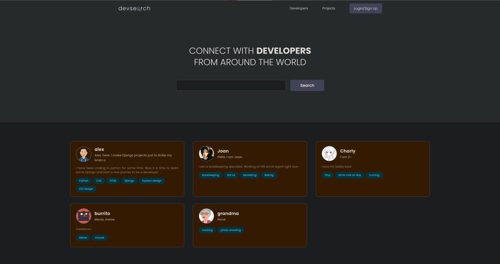
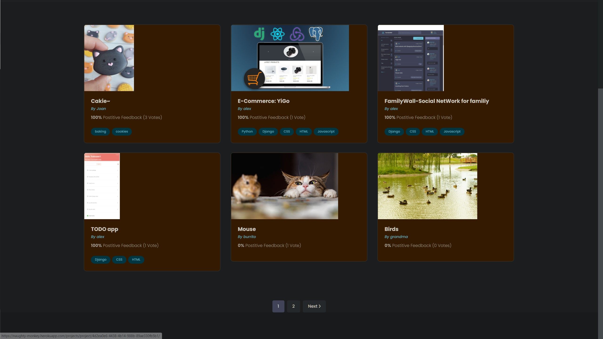
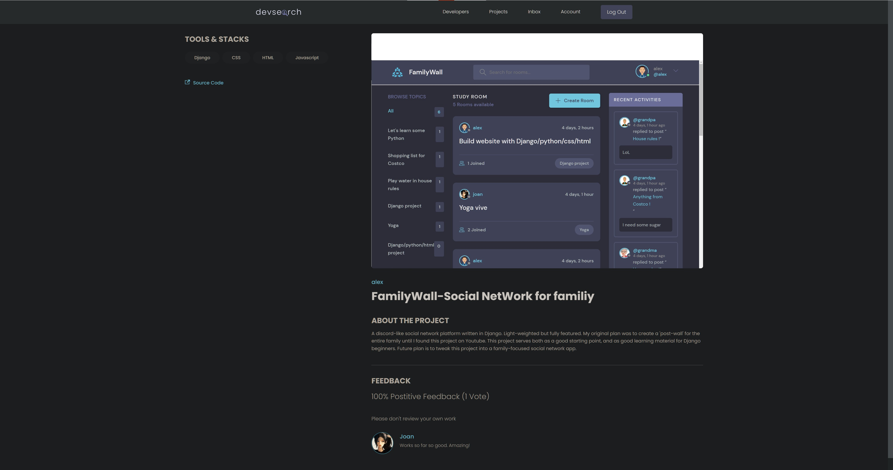
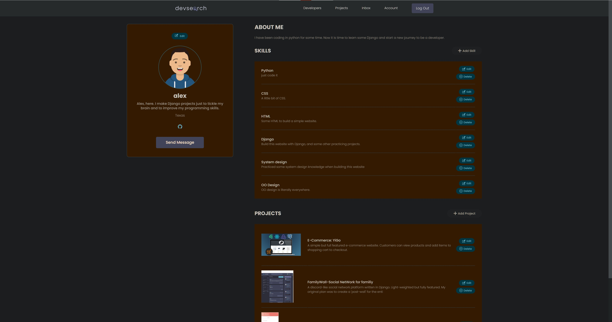
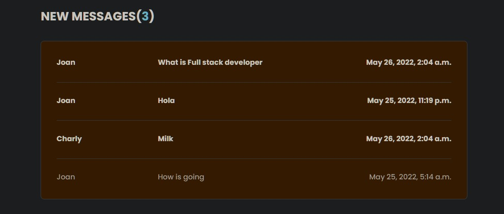
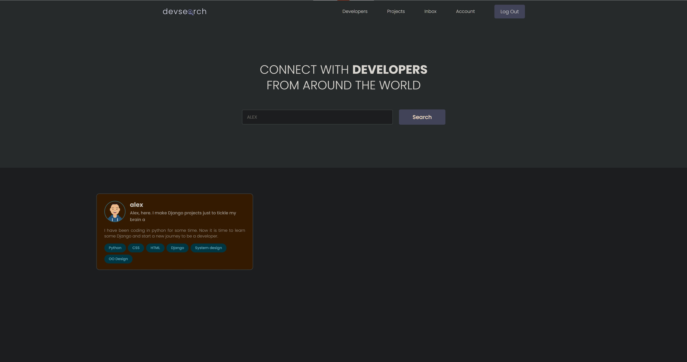
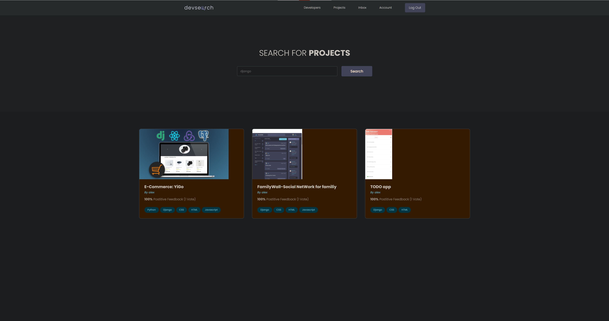

# naughtymonkey
A social website written in Django. Users can display their works here and rate other's projects.
I followed this project as an online course but coded independently to learn Django and web design.

Link: https://naughty-monkey.herokuapp.com/

# Features
* User registeration and authentication.
* Display and share Projects.
* Send messages to other people.
* View messages in user inbox
* Comment and rate others work.
* Search people and projects by keywords.

# Tech Stack
* Django, Python
* Postgres, AWS
* Django REST Framework
* Deployed on Heroku

# Home Page
  

# Projects Page
  

# Project details Page
  

# Profile Page

# User Inbox
  

# Search for Developers
  

# Search for projects
  
